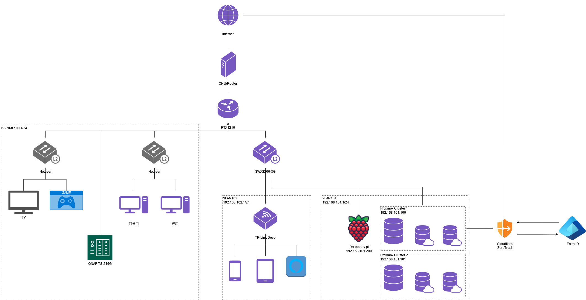

# おうちネットワーク整理

すぐ忘れるので記録用。

## 構成



## 簡単な説明

### ONU と Router の関係

弊宅は ONU とルータが一体型になって提供される回線を利用している。

そのため、 RTX1210 で NAT 変換してあげる必要がある。

方法については下記サイトを参考に設定。

https://kaiza.org/blog/blog/2023/05/nuro-zxt-f660prtx1210.html

### VLAN の分け方について

一部 VLAN になっていないところはサブネットで分けられると設定が面倒になりそうだった部分(結局困らなかった)

分けてあるところは以下のように定義

- VLAN101：サーバ、検証用
- VLAN102：無線 LAN 関係全て

## IPv6 対応

上記方法のみだと ipv6 対応できない。以下を参考に設定。

https://qiita.com/buttyo_kuny/items/c2521d8c6919b982861e

## L2 スイッチと VLAN の導入

ネットワークの勉強するには形からということでヤフオクで SWX2200-8G を購入し、VLAN を導入。

VLAN の設定は MAC アドレスを指定するやり方で対応。

https://network.yamaha.com/setting/router_firewall/switch_control/switch_swx-command/tag_vlan

## VLAN から ping が通らない

porxmox や Raspberry pi から `ping 1.1.1.1` などが通らず泣いていたら以下の記事を見つけた。

ICMP が許可されていないだけだった。恥ずかしい。

```config
ip filter 10 pass * * icmp
ip lan2 secure filter in 10 101003 101020 101021 101022 101023 101024 101025 101030 101032 101100
save
```

https://sys-guard.com/post-15730/

## 作業記録リンク

[こちら](links.md) に作業記録をまとめている

[generate_links.sh](generate_link.sh) で生成して作成している

余談：generate_links.sh は GPT-4o(無料トライアル枠？) でほぼほぼ作成

## 便利リンク

docker コマンド

https://qiita.com/Ikumi/items/b319a12d7e2c9f7b904d

## やりたいことリスト

- 未

  - NAS の有効活用(SD カードの転送自動化)
  - Guacamole の RPD 接続がどれくらい使い物になるか確認(ubuntu でやったら失敗した 😭)
  - proxmox on proxmox
  - proxmox 内の VLAN 環境作成
  - wake on lan の設定(別サブネットからの起動)
  - postgresql 追加負荷テスト(TPC-H/TPC-DS/DBT-3)
  - ブログ開発

- 済

  - Cloudflare tunnel + Microsoft Entra ID を利用したセキュアなアクセス
  - Guacamole 経由のアクセス
  - minecraft サーバ
  - Raspberry pi の活用(zabbix による監視)
  - wake on lan
  - 作業記録ジェネレータ
  - postgresql 負荷テスト
  - psotgresql 比較ツール開発
  - factorio サーバ
  - Fortigate 50E に OpenWrt をインストール
  - docker-osx やる https://github.com/sickcodes/Docker-OSX

- 保留
  - zabbix をつかった高度な監視(Grafana いれたので)
  - factorio 認証(Auto Frogeがおもしろいので)
