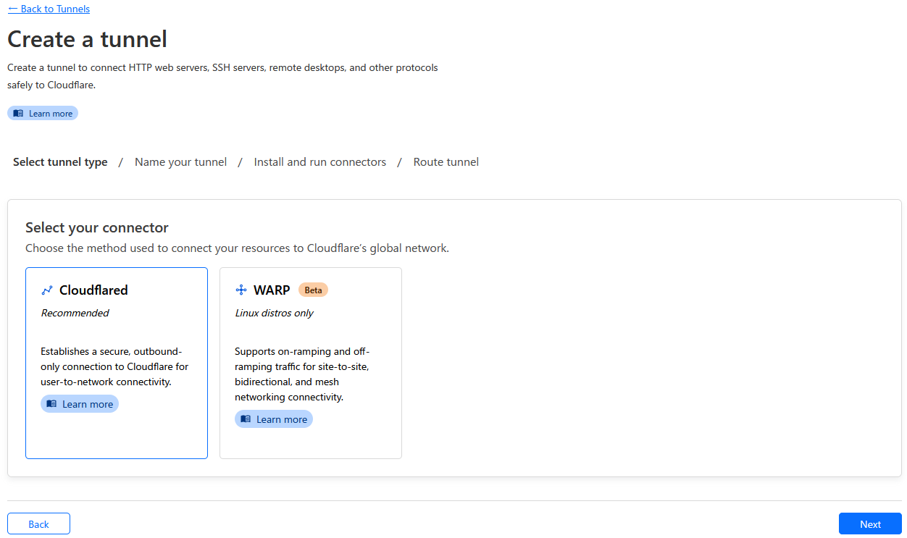
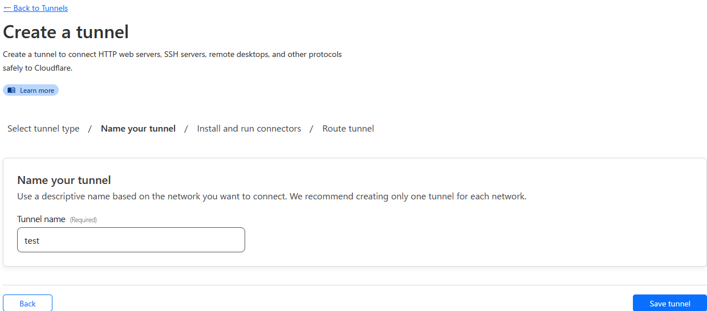
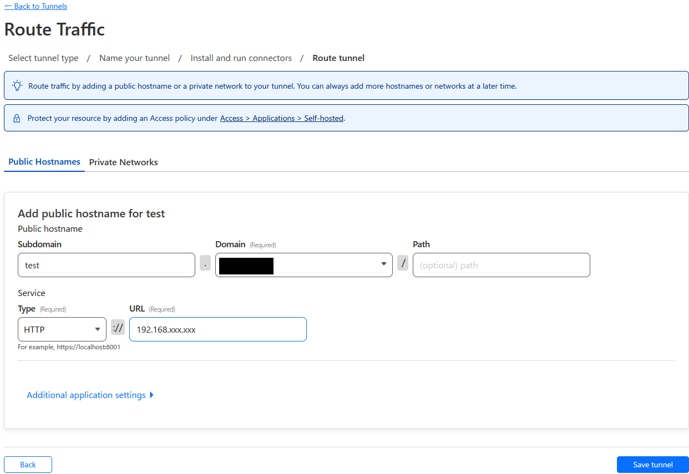
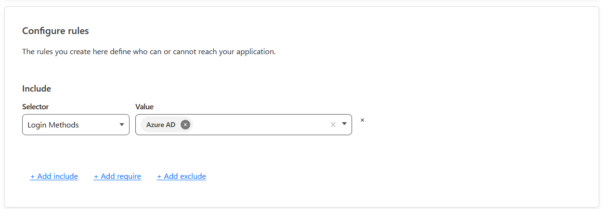
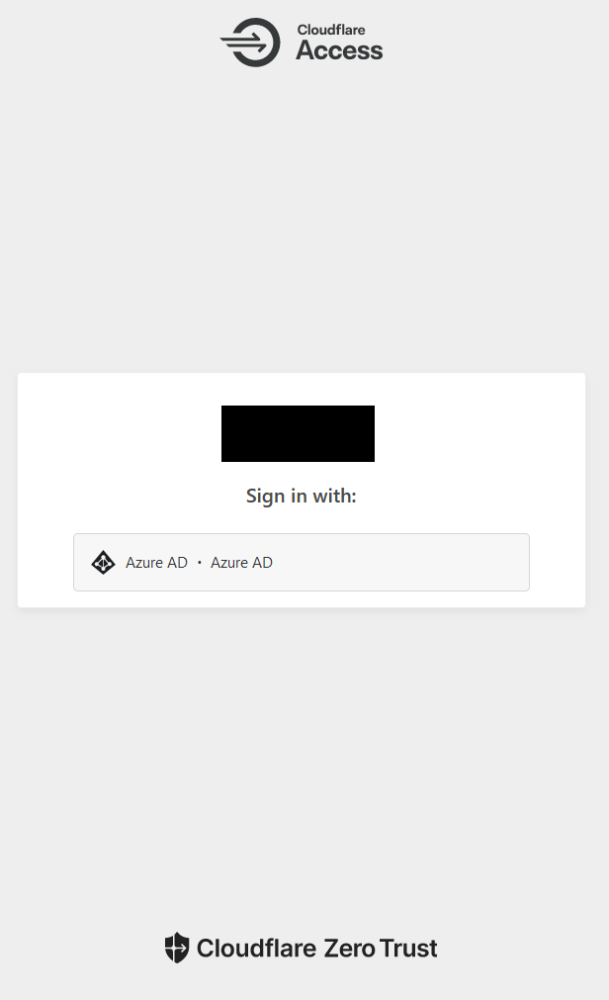

# Cloudflare tunnel と Microsoft Entra ID(旧 Azure AD) を利用してお家ネットワークにセキュアにアクセスする

proxmox は Cloudflare tunnel を活用して特定のメールアドレスを入力すると、そのメールアドレス宛てにワンタイムパスワードが届くような仕組みを取っていた。

しかしながらメールが来るタイミングが 10 分かかったりメールが届かなかったりしてあまりに気に入っていなかった。

困っていたら会社で「EntraID(以下、Azure AD) でやってみたで～」って人にやり方教えてもらった。

色々と忘れていたりしたので入れたかった Apache Guacamole もいれつつ手順をまとめる。

## おおまかな手順

1. Azure AD を登録
1. Cloudflare で Tunnel 登録
1. Applications を登録
1. Policy を登録
1. アクセス確認
1. 502 が出る場合の対処法(RTX1210 編)

## Azure AD を登録

### 前提

- Microsoft Azure アカウントが必要
- クレジットカード登録が必要

### 実際の手順

ほぼこれの通りにやったら出来た

https://dev.classmethod.jp/articles/cloudflare-zero-trust-idp-integration-aggregation/

### ハマったところ

間違えて Azure AD の方は本名 Gmail アカウント、

認証を趣味用 Gmail アカウントでやろうとしてはじかれた。

当たり前体操すぎるが、30 分くらいハマった。

本当は組織から作ってあーだこーだするらしいが、自分は個人なので下記手順で作った

https://support.ptc.com/help/identity_and_access_management/ja/index.html#page/iam/AzureADCreateInviteUsers.html

## Tunnel 登録

Networks>Tunnel>Create a tunnel

Cloudflared を選択>Next



適当に名前つけて>save tunnel



インストール先に合わせて Install and runconnector を選択

今回は Debian でインストール

```shell
curl -L --output cloudflared.deb https://github.com/cloudflare/cloudflared/releases/latest/download/cloudflared-linux-amd64.deb &&

sudo dpkg -i cloudflared.deb &&

sudo cloudflared service install [API Key]
```

外からのアクセス先を public hostname に指定

Routing したいプライベートネットワークを Service に記載

※Guacamole は http なので http を指定

最後に Save tunnel をしてここの設定は終わり



## Applications を登録

## Overview

Add an application>Self-hosted

- Application name：(任意)
- Session Duration：(任意)

### Application domain

- Subdomain：\*
- Domain：先ほど登録したドメイン

## Policies

Add a Policy

- Policy name：(任意)
- Action：Allow
- Session duration：(任意)

### Configure rules

Include

Save policy 忘れずに

- Selector：Login Methods
- Value：Azure AD



## 確認

https://(subdomain).(fqdn) でアクセスして以下の画面が表示されていれば OK



## 502 が出る場合の対処法(RTX1210 編)

VLAN 内のサーバに接続するようにしていたためポートの許可が足りていなかった。

guacamole の場合は 8080 を通してやるようにすれば OK

```config
ip filter 808080 pass * 192.168.101.111 tcp * 8080
```
