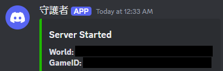

# Core keeper Dedicated Server の導入

## おまじない

```shell
apt install update && apt install upgrade -y
apt install vim
```

## Docker のインストール

```shell
sudo apt update
sudo apt install ca-certificates curl
sudo install -m 0755 -d /etc/apt/keyrings
sudo curl -fsSL https://download.docker.com/linux/ubuntu/gpg -o /etc/apt/keyrings/docker.asc
sudo chmod a+r /etc/apt/keyrings/docker.asc
```

リストにインストールするパッケージを追加

```shell
echo \
  "deb [arch=$(dpkg --print-architecture) signed-by=/etc/apt/keyrings/docker.asc] https://download.docker.com/linux/ubuntu \
  $(. /etc/os-release && echo "$VERSION_CODENAME") stable" | \
  sudo tee /etc/apt/sources.list.d/docker.list > /dev/null
sudo apt-get update
```

インストール
```shell
 sudo apt-get install docker-ce docker-ce-cli containerd.io docker-buildx-plugin docker-compose-plugin
 ```
 
## ユーザ追加

```shell
adduser keeper
usermod -aG docker keeper
```
## Core Keeper Dedicated Server

```shell
git clone https://github.com/escapingnetwork/core-keeper-dedicated.git
cd core-keeper-dedicated/docker-compose-example
```
### 変更する項目

core.env

 - `WORLD_NAME`:わかりやすい感じの名前を付ける
 - `WORLD_SEED`:0にするとランダム生成
 - `MAX_PLAYERS`:最大接続数
 - `DISCORD_WEBHOOK_URL`:設定すると通知飛ばす
 
 docker-compose.yml
 
 今回は変更なし

## 起動

`docker compose up -d`

`DISCORD_WEB_HOOK`を有効にしていた場合、1分後くらいに通知くる

