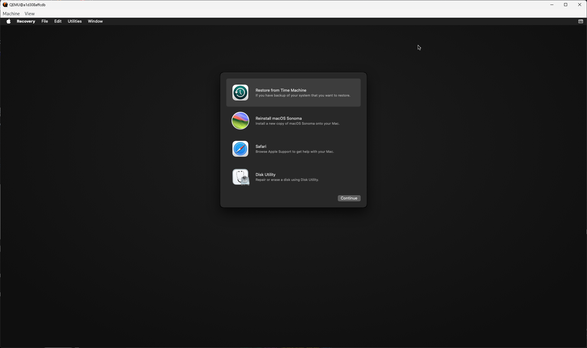

# Docker Desktop for Windows に docker-osx を入れて WSL2 から起動する

Mac の環境が欲しいので Docker-OSX を試す

https://github.com/sickcodes/Docker-OSX

## 前提情報

- OS は Windows 11 Pro
- Docker Desktop for Windows がインストールされており、アカウント登録がされている
- vcxsrv が Windows にインストールされている
- WSL2 がインストールされている

## 1. .wslconfig の追記

`~/.wslconfig` に以下を追記する

```config
[wsl2]
nestedVirtualization=true
```

## 2. kvm のインストール

```shell
sudo apt -y install bridge-utils cpu-checker libvirt-clients libvirt-daemon qemu qemu-kvm
```

kvm が正しくインストールされたか確認

```shell
kvm-ok
```

```shell
INFO: /dev/kvm exists
KVM acceleration can be used
```

## 3. X-11 をインストール

X11 もインストールする

```shell
sudo apt install x11-apps -y
```

次へ


Start no client


全チェックして Additinal parameters for VcXsrv で `-ac` と追記


完了


### 起動確認

wsl から `xeyes` から起動

かわいい！


## 4. インストール

Mac OS X Sonoma をインストール

```shell
docker run -it \
    --device /dev/kvm \
    -p 50922:10022 \
    -v /mnt/wslg/.X11-unix:/tmp/.X11-unix \
    -e "DISPLAY=${DISPLAY:-:0.0}" \
    -e GENERATE_UNIQUE=true \
    -e CPU='Haswell-noTSX' \
    -e CPUID_FLAGS='kvm=on,vendor=GenuineIntel,+invtsc,vmware-cpuid-freq=on' \
    -e MASTER_PLIST_URL='https://raw.githubusercontent.com/sickcodes/osx-serial-generator/master/config-custom-sonoma.plist' \
    sickcodes/docker-osx:sonoma
```

## 5. 初期設定

以下の画面が起動してきたらここまでの手順は成功

mac base System


Disk Utility



uninitialized のディスクを選択して、 erase を選択


適当に名前を付けて実行

完了したら done を押下して、左上の × ボタンを閉じる


閉じると以下の画面に戻ってくるので、Reinstall macOS Sonoma を選択


ここまで来たら普通の Mac のインストールとほぼ一緒なので省略


## 課題

適当にシャットダウンしたら消えてしまった

残しておくにはどうしたらいいんだ・・？
