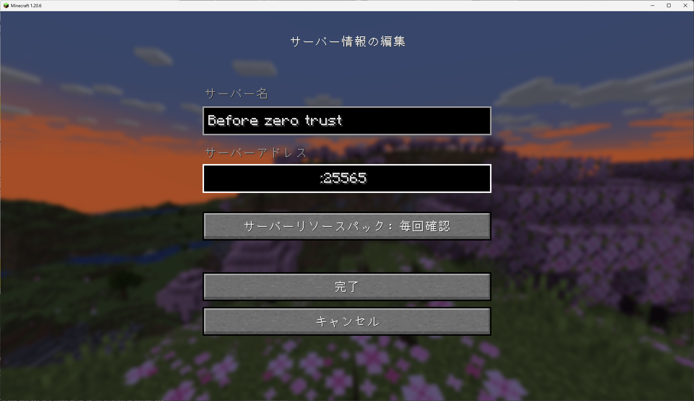

# minecraft server セットアップと + cloudflare azure AD 認証を活用したログイン

## 流れ

1. minectaft サーバをインストール
1. cloudflare tunnel の登録(cloudflared(server)のインストール)
1. cloudflared(client) のインストール
1. minectft でサーバへログイン

## 前提

### 基本情報

サーバ側

- OS：ubuntu 2404
- Mem：4GB
- Disk：120GB
- Core:4
- minecraft バージョン：1.20.6

今回は Spigot server を入れる

クライアント側

- OS：Windows 11 Pro

## おまじない

```shell
apt update && apt upgrade -y
apt install vim git curl -y
```

## 初期設定

### screen インストール

起動中の操作を楽にするために screen をインストール

```shell
apt install screen -y
```

### openjdk をインストール

java は minecraft 1.20 以降から openjdk-21-jdk を使う

Xserver for Game が通知してくれている  
https://game.xserver.ne.jp/news/detail.php?view_id=12570

```shell
apt install openjdk-21-jdk
```

### ユーザ作成

```shell
adduser minecraft
```

以降 minecraft ユーザで操作

```shell
su - minecraft
```

### Firewall の設定

TCP 25565 を使うのであける

```shell
ufw enable
ufw allow 25565
ufw reload
ufw status
```

## minecraft サーバをインストール

### BuildTools のダウンロード

DMCA 問題の回避のために直接 DL してはいけないらしいので自分で build する

BuildTools.jar の DL

```shell
wget https://hub.spigotmc.org/jenkins/job/BuildTools/lastSuccessfulBuild/artifact/target/BuildTools.jar
```

Build する --rev のあとは minecraft を指定する

なんかよくわからんけど git clone するのに滅茶苦茶時間かかった

全部で 13 分くらいだった

```shell
java -jar BuildTools.jar --rev 1.20.6
```

spigot-1.20.6.jar ができていることを確認

```shell
minecraft@minecraft:~$ ls -alF
total 79048
drwxr-x--- 11 minecraft minecraft     4096 May 13 14:48 ./
drwxr-xr-x  3 root      root          4096 May 13 14:17 ../
-rw-------  1 minecraft minecraft      183 May 13 14:31 .bash_history
-rw-r--r--  1 minecraft minecraft      220 May 13 14:17 .bash_logout
-rw-r--r--  1 minecraft minecraft     3791 May 13 14:18 .bashrc
drwxrwxr-x  3 minecraft minecraft     4096 May 13 14:34 .config/
drwxrwxr-x  3 minecraft minecraft     4096 May 13 14:45 .m2/
-rw-r--r--  1 minecraft minecraft      807 May 13 14:17 .profile
-rw-------  1 minecraft minecraft      923 May 13 14:18 .viminfo
drwxrwxr-x  5 minecraft minecraft     4096 May 13 14:45 BuildData/
-rw-rw-r--  1 minecraft minecraft  3445500 Mar 30 00:25 BuildTools.jar
-rw-rw-r--  1 minecraft minecraft  1434267 May 13 14:48 BuildTools.log.txt
drwxrwxr-x  4 minecraft minecraft     4096 May 13 14:37 Bukkit/
drwxrwxr-x  5 minecraft minecraft     4096 May 13 14:46 CraftBukkit/
drwxrwxr-x  7 minecraft minecraft     4096 May 13 14:46 Spigot/
drwxrwxr-x  6 minecraft minecraft     4096 May 13 14:45 apache-maven-3.9.6/
drwxrwxr-x  4 minecraft minecraft     4096 May 13 14:35 bukkit/
-rw-rw-r--  1 minecraft minecraft 75986906 May 13 14:48 spigot-1.20.6.jar
drwxrwxr-x  3 minecraft minecraft     4096 May 13 14:46 work/
```

### 初回起動確認

初回実行はすぐ終わる

```shell
java -Xmx1024M -Xms1024M -jar spigot-1.20.6.jar
```

```shell
(前略)
Starting server
Loading libraries, please wait...
[14:49:58] [ServerMain/WARN]: Failed to load eula.txt
[14:49:58] [ServerMain/INFO]: You need to agree to the EULA in order to run the server. Go to eula.txt for more info.
```

~/eula.txt で同意する

```shell
vim ~/eula.txt
```

```txt
eula=true
```

## 起動確認

### Screen 起動

```shell
screen
```

```shell
java -Xmx2048M -Xms2048M -jar spigot-1.20.6.jar
```

## minecraft 側の確認

- サーバ名：(適当)
- サーバアドレス：[IP アドレス]:25565




## cloudflare tunnel の登録(cloudflared(server)のインストール)

1. Cloudflare>Zero Trust>Networks>Create a tunnel
1. Cloudflared>Next
1. Name your tunnel を minecraft > next
1. Choose your environmnet で Debian 64-bit を選択
1. 表示されたコマンド`crul -L --output ...`を `root`で実行
1. Public Hostname Page
   - Subdomain：(適当、mc など)
   - Domain：(登録しているドメイン)
   - Path：(任意)
   - Type：TCP
   - URL：localhost:25565

Status が HEALTHY になっていたら OK


Access>Applications の設定は[他でやっている](../cloudflare/manual.md)ので省略

## cloudflared(client) のインストール

今回は http/https ではないため client 側にも cloudflared をインストールする必要がある

今回は Windows なので、[公式](https://developers.cloudflare.com/cloudflare-one/connections/connect-networks/downloads/)にそって winget でインストールする。

Powershell を起動して以下を実行

```shell
winget install --id Cloudflare.cloudflared
```

**その後 Powershell を再起動すること**

### cloudflared の起動

--url のポート番号は開いていたら適当で OK

- --hostname：Cloudflare で設定したアドレス
- --url：localhost:[任意のポート番号 j]

```shell
cloudflared access tcp --hostname [Cloudflare で設定したアドレ] --url localhost:20100
```

## minectft でサーバへログイン

サーバアドレスには先ほどの --url で設定したアドレスを入力


そうするとブラウザでログイン画面が立ち上がるので設定してあるログイン方法でログイン

成功すると以下の画面が出てきてアクセスできるようになる


## 設定した感想

ポートを開けずに minecraft のサーバを公開できるの良すぎるし簡単すぎて良い

一緒にやる友達はいないんだけどね

## 参考

minecraft server の構築

https://cyberhub.jp/posts/9

cloud tunnel の設定

https://qiita.com/zypr/items/997afdb487b4ead2eb11
