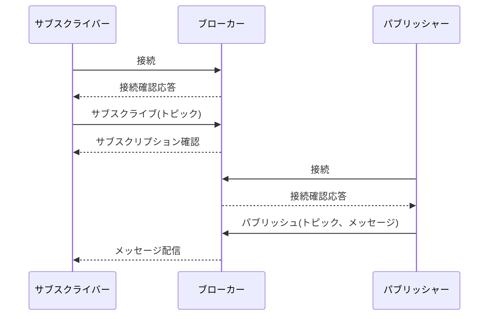
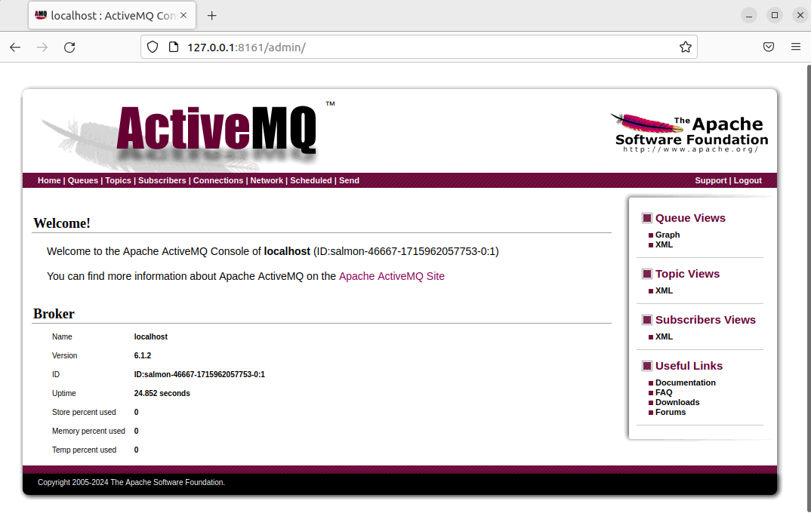
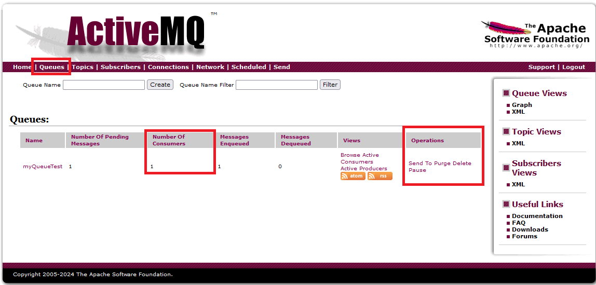
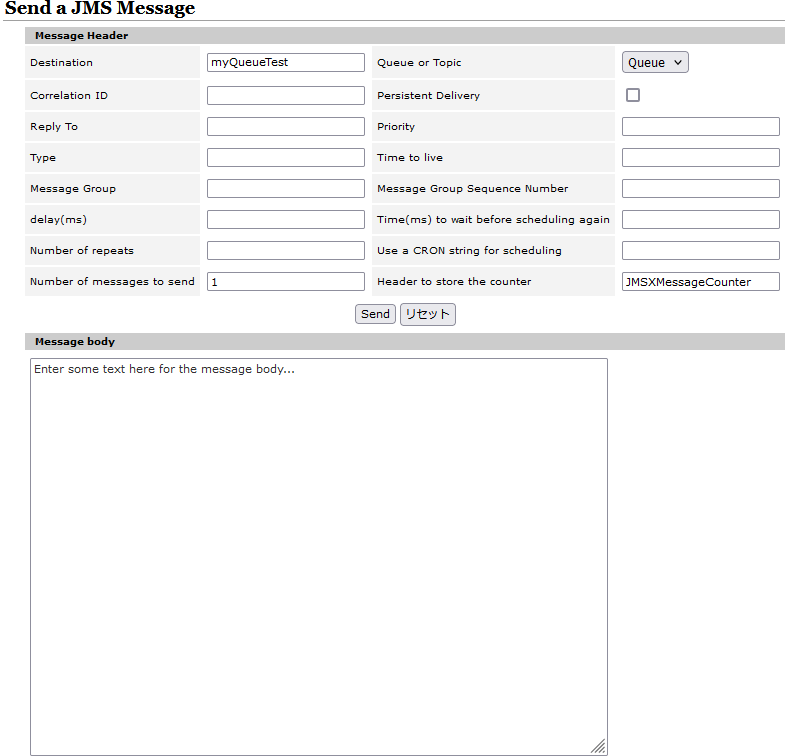
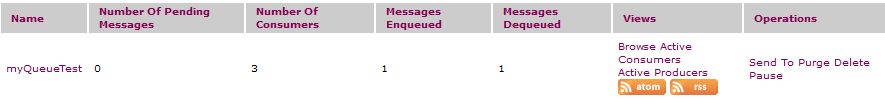
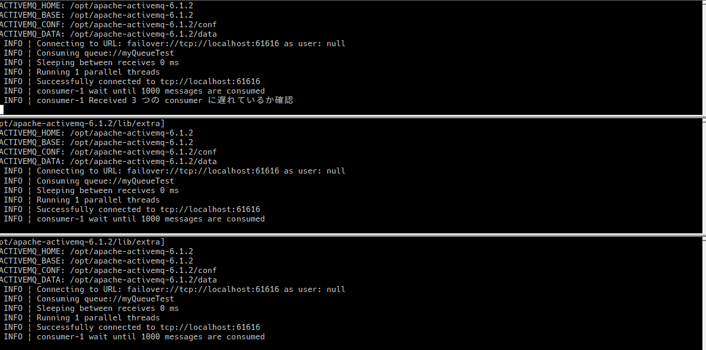
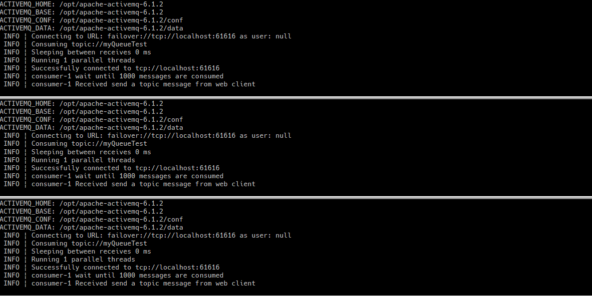

# MQTT ことはじめ




## 前提

- Broker
  - ActiveMQ Classic
- Client
  - Nodejs
    - mqtt-connection

## 準備

### java インストール

ActiveMQ 6.1.2 は openjdk 16 以上とのことなので、

`apt list` で出来てきた一番古いバージョンをインストール

```shell
sudo apt install openjdk-17-jdk
```

### インストール

```shell
cd /opt
sudo wget https://dlcdn.apache.org//activemq/6.1.2/apache-activemq-6.1.2-bin.tar.gz
sudo tar zxvf apache-activemq-6.1.2-bin.tar.gz
sudo chown -R sushi:sushi apache-activemq-6.1.2
sudo ln -s /opt/apache-activemq-6.1.2 activemq
```

http://127.0.0.1:8161/admin にアクセス

admin/admin でログイン



[!TIP]
デフォルトでは localhost のみアクセスが許可されている。
`conf/jetty.xml` を編集することで対応
`127.0.0.1`を`0.0.0.0`にすること他デバイスからも接続することが可能

```xml
<bean id="jettyPort" class="org.apache.activemq.web.WebConsolePort" init-method="start">
    <!-- the default port number for the web console -->
    <property name="host" value="0.0.0.0"/>
    <property name="port" value="8161"/>
</bean>
```

## 動かしてみる

```shell
/opt/activemq/bin/activemq consumer --destination queue://myQueueTest
```

```shell
(前略)
  [/opt/apache-activemq-6.1.2/lib,/opt/apache-activemq-6.1.2/lib/camel,/opt/apache-activemq-6.1.2/lib/optional,/opt/apache-activemq-6.1.2/lib/web,/opt/apache-activemq-6.1.2/lib/extra]
ACTIVEMQ_HOME: /opt/apache-activemq-6.1.2
ACTIVEMQ_BASE: /opt/apache-activemq-6.1.2
ACTIVEMQ_CONF: /opt/apache-activemq-6.1.2/conf
ACTIVEMQ_DATA: /opt/apache-activemq-6.1.2/data
 INFO | Connecting to URL: failover://tcp://localhost:61616 as user: null
 INFO | Consuming queue://myQueueTest
 INFO | Sleeping between receives 0 ms
 INFO | Running 1 parallel threads
 INFO | Successfully connected to tcp://localhost:61616
 INFO | consumer-1 wait until 1000 messages are consumed
```

ActiveMQ からメッセージを送信

1. Queues を押下
1. Number of Consumers が 1 になっていることを確認
1. Send to を押下



Message body に送信したい内容を決定



先ほど Consumer を起動したターミナルでメッセージが増えていることを確認。

```shell
 INFO | consumer-1 Received Enter some text here for the message body...
```

## 複数の Consumer に対して Queue を送ってみる

consumer は複数起動していても 1 つの consumer にしか送信されないことを確認する

実行コマンドは全て同じ

その 1

```shell
/opt/activemq/bin/activemq consumer --destination queue://MyQueueTest
```

その 2

```shell
/opt/activemq/bin/activemq consumer --destination queue://MyQueueTest
```

その 3

```shell
/opt/activemq/bin/activemq consumer --destination queue://MyQueueTest
```

Number of consumers が 3 になっていることを確認



送り方は先ほどと同じなので省略

1 つの consumer しか受け取れていないことを確認



## 複数の consumer に対して Topic にメッセージを送る

consumer を起動

先ほどは `queue://` で起動していたが、今回は `topic://`で起動していることに注意

Producer を使ってメッセージを送信

3 つとも同じコマンドで実行

その 1

```shell
/opt/activemq/bin/activemq consumer --destination topic://myQueueTest
```

その 2

```shell
/opt/activemq/bin/activemq consumer --destination topic://myQueueTest
```

その 3

```shell
/opt/activemq/bin/activemq consumer --destination topic://myQueueTest
```

送信

全てのターミナルに配信されていることを確認



## 備考

コマンドからもできるはずだが、複数コマンド(`--destination`や`--messageCount`)が作動しておらず上手くいかなかった

## Queue と Topic の違い

| 名前   | セマンティック | メッセージの受信の仕方                                                                                                                               |
| ------ | -------------- | ---------------------------------------------------------------------------------------------------------------------------------------------------- |
| Queues | Load Balancer  | そのときの active な 1 つの cunsumer にメッセージが送られる。active な consumer がいなければ active な consumer が現れるまでメッセージは保留される。 |
| Topics | Pub/Sub        | そのときの active な全ての consumer にメッセージが送られる。                                                                                         |

## 参考

公式 Example

https://activemq.apache.org/components/classic/documentation/examples

参考にした qiita 記事

https://qiita.com/toshiyukihina/items/a6abdff5bf701b1c2773
