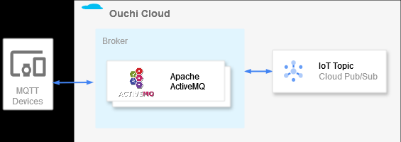
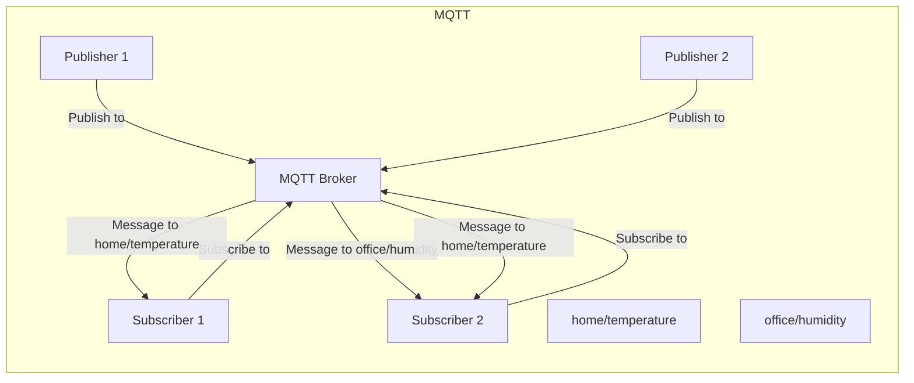

# MQTT ことはじめ

## 前提

- Broker
  - ActiveMQ Classic
- Client
  - Nodejs
    - mqtt-connection

## やったこと

後で書く

## Queue と Topic の違い

| 名前   | セマンティック | メッセージの受信の仕方                                                                                                                               |
| ------ | -------------- | ---------------------------------------------------------------------------------------------------------------------------------------------------- |
| Queues | Load Balancer  | そのときの active な 1 つの cunsumer にメッセージが送られる。active な consumer がいなければ active な consumer が現れるまでメッセージは保留される。 |
| Topics | Pub/Sub        | そのときの active な全ての consumer にメッセージが送られる。                                                                                         |

## 参考

公式 Example
https://activemq.apache.org/components/classic/documentation/examples

参考にした qiita 記事

https://qiita.com/toshiyukihina/items/a6abdff5bf701b1c2773
