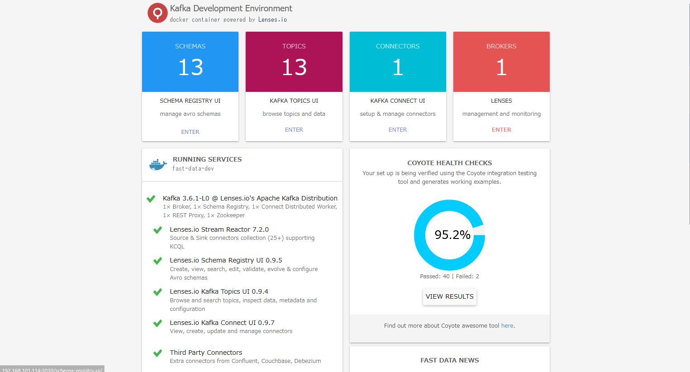

# Kafka インストール

## Docker インストール

```shell
# もし古いdockerを入れていた場合は、removeします
for pkg in docker.io docker-doc docker-compose docker-compose-v2 podman-docker containerd runc; do sudo apt-get remove $pkg; done

# GPGキーを追加
sudo apt update
sudo apt install ca-certificates curl
sudo install -m 0755 -d /etc/apt/keyrings
sudo curl -fsSL https://download.docker.com/linux/ubuntu/gpg -o /etc/apt/keyrings/docker.asc
sudo chmod a+r /etc/apt/keyrings/docker.asc

# repo追加
echo \
  "deb [arch=$(dpkg --print-architecture) signed-by=/etc/apt/keyrings/docker.asc] https://download.docker.com/linux/ubuntu \
  $(. /etc/os-release && echo "$VERSION_CODENAME") stable" | \
  sudo tee /etc/apt/sources.list.d/docker.list > /dev/null
sudo apt update

# インストール
sudo apt install docker-ce docker-ce-cli containerd.io docker-buildx-plugin docker-compose-plugin

docker --version
# Docker version 26.1.0, build 9714adc
# composeプラグインを入れたので、docker composeも確認
docker compose version
# Docker Compose version v2.26.1

# enableしましょう
sudo systemctl enable docker
sudo systemctl status docker
```

## ユーザ作成

```shell
adduser kafka
usermod -aG docker kafka
su - kafka
```

以後、kafka ユーザで操作

## docker-compose

docker-compose.yml

```yaml
version: "2"

services:
  landoop:
    image: "landoop/fast-data-dev"
    network_mode: "host"
    container_name: "landoop"
    mem_limit: 3G
    environment:
      ADV_HOST: "EXPORTするIPアドレス"
      USER: "Basic認証のユーザ名"
      PASSWORD: "Basic認証のパスワード"
    volumes:
      - /path/to/3rd/Party/Connector/Jars:/connectors
    ports:
      - "2181:2181"
      - "3030:3030"
      - "8081-8083:8081-8083"
      - "9581-9585:9581-9585"
      - "9092:9092"
```

### 起動

http://[IP アドレス]:3030 にアクセスして上で入力したユーザ名/パスワードでログイン

```shell
docker compose up -d
```

あまりにもメモリ積んでなくて 1 回落ちたせいだと思うけど、COYOTE HEALTH CHECK が終わってる



## MQTT の準備

後で書く

## 参考

Docker インストール

https://qiita.com/hkusaba/items/e5171ab77e3cacf1ddd2

Kafka インストール

https://qiita.com/Takashi_Kasuya/items/0c6fbdba6c4631f2ea38

```

```
