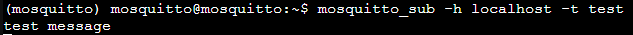
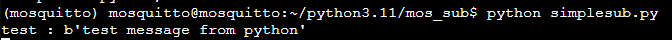

# mosquitto 勉強

以下を参考に mosquitto 環境を作成

https://qiita.com/koichi_baseball/items/8fa9e0bdbe6d0aebe57d

## ユーザ作成

```shell
adduser mosquitto
usermod -aG sudo mosquitto
```

## mosquitto, mosquitto-client のインストール

```shell
apt install -y mosquitto mosquitto-clients
```

## python のインストール

python から送信するライブラリをインストールするために python をインストール

今回は以下を参考に切り替え可能な環境でインストールする

https://qiita.com/murakami77/items/b612734ff209cbb22afb

```shell
apt install -y python3 python3-pip
```

リポジトリ追加

```shell
apt install -y software-properties-common
add-apt-repository ppa:deadsnakes/ppa
apt update
```

インストール可能リストの確認

```shell
apt list python3.*
```

気分的に 3.10 と 3.11 をインストール

```shell
apt install -y python3.10 python3.10-venv
apt install -y python3.11 python3.11-venv
```

定義

```shell
update-alternatives --install /usr/bin/python python /usr/bin/python3.10 310
update-alternatives --install /usr/bin/python python /usr/bin/python3.11 311
```

## 切り替え方法

```shell
update-alternatives --config python
```

以下のように表示されるので変更したい番号を選択する

```shell
There are 2 choices for the alternative python (providing /usr/bin/python).

  Selection    Path                 Priority   Status
------------------------------------------------------------
* 0            /usr/bin/python3.11   311       auto mode
  1            /usr/bin/python3.10   310       manual mode
  2            /usr/bin/python3.11   311       manual mode

Press <enter> to keep the current choice[*], or type selection number: 0
```

バージョンを確認する

```shell
python -V
```

```shell
Python 3.11.9
```

## venv

Python 3.11 に mosquitto ユーザで`~/python3.11`に `mosuquitto`環境を作る

```shell
mkdir ~/python3.11
cd ~/python3.11
```

バージョンを事前確認

```shell
python -V
Python 3.11.9
```

vnev 環境を作る

```shell
python -m venv mosquitto
```

## 有効化

```shell
source ~/python3.11/mosquitto/bin/activate
```

以下のように表示されたら有効化できている

```shell
(mosquitto) mosquitto@mosquitto:~$
```

## pip 更新

```shell
python -m pip install --upgrade pip
```

## pip でパッケージインストール

```shell
python -m pip install [パッケージ名]
```

## クライアント(python)のインストール

```shell
python -m pip install paho-mqtt
```

## クライアント(java)のインストール

```shell
mkdir ~/mqttv3
cd ~/mqttv3
wget https://repo.eclipse.org/content/repositories/paho-releases/org/eclipse/paho/org.eclipse.paho.client.mqttv3/1.2.5/org.eclipse.paho.client.mqttv3-1.2.5.jar
```

## mosquitto server の実行

```shell
sudo systemctl start mosquitto
```

実行できているか確認

```shell
sudo systemctl start mosquitto
```

```shell
[sudo] password for mosquitto:
Sorry, try again.
[sudo] password for mosquitto:
(mosquitto) mosquitto@mosquitto:~$ sudo systemctl status mosquitto
* mosquitto.service - Mosquitto MQTT Broker
     Loaded: loaded (/lib/systemd/system/mosquitto.service; enabled; vendor preset: enabled)
     Active: active (running) since Tue 2024-05-21 12:22:35 UTC; 1h 15min ago
       Docs: man:mosquitto.conf(5)
             man:mosquitto(8)
   Main PID: 7443 (mosquitto)
      Tasks: 1 (limit: 77016)
     Memory: 1.2M
        CPU: 1.154s
     CGroup: /system.slice/mosquitto.service
             `-7443 /usr/sbin/mosquitto -c /etc/mosquitto/mosquitto.conf

May 21 12:22:35 mosquitto systemd[1]: Starting Mosquitto MQTT Broker...
May 21 12:22:35 mosquitto systemd[1]: Started Mosquitto MQTT Broker.
```

## publisher, subscriber の起動

```shell
mosquitto_sub -h localhost -t test
```

待機画面になってしまうので新しい画面で publisher を立ち上げる

```shell
mosquitto_pub -h localhost -t test -m "test message"
```

subscriber の方で `test message`が表示される



## Python 編

[公式サンプル](https://github.com/eclipse/paho.mqtt.python/tree/master/examples)があるらしい

ディレクトリを作成

```shell
mkdir ~/python3.11/mos_sub
```

`venv` 入ってない場合は `activate`

```shell
source ~/python3.11/mosquitto/bin/activate
```

ディレクトリ作成して `simplepub.py`を作成

```shell
mkdir ~/python3.11/mos_sub/
cd ~/python3.11/mos_sub/
touch simplepub.py
touch simplepub_loop.py
```

```python
# simplepub.py
import paho.mqtt.publish as publish

publish.single("[トピック名]", "[メッセージ内容]", hostname="[ホスト名]")
```

```python
# simplepub_loop.py
import paho.mqtt.publish as publish
import time

i = 0
while True:
    time.sleep(3)
    i += 1
    print(i)
    # publish.single("[トピック名]", "[メッセージ内容]", hostname="[ホスト名]")
    publish.single("testTopic2",i, hostname="localhost")
```

subscriber は callback 関数を利用

```shell
# simplesub.py
import paho.mqtt.subscribe as subscribe

topics = 'tset'

def print_mes(client, userdata, message):
    print("%s : %s" % (message.topic, message.payload))

while True:
    subscribe.callback(print_mesg, "test", hostname="localhost")
```

subscribe

```shell
python simplesub.py
```

publish

```shell
python simplepub.py
```



python からもメッセージが送れてハッピー 🤗

## 次回予告

python で MQTT 送受信

https://qiita.com/hsgucci/items/6461d8555ea1245ef6c2

MQTT ライブラリ Paho Python を理解しようとしてみる

https://www.sunbit.co.jp/blog/2019/11/21802/
