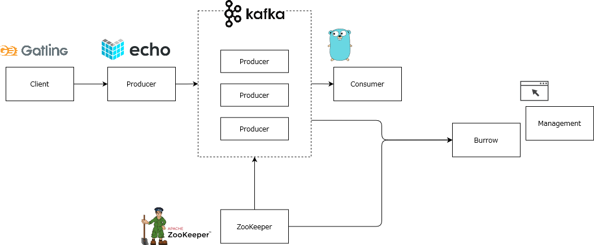

# kafka train を試す

この方が kafka ツールをまとめた docker compose を作ってくれているのでこれを使って勉強していく

https://qiita.com/tarosaiba/items/b3d1c49c2cc5e773babf

いったんは動かしてみて、その後自分で構築しながら学ぶ

## 構成の確認

上記記事を参考に図を自分で作成



## リポジトリを pull

```shell
mkdir kafka-train
cd kafka-train
git clone https://github.com/tarosaiba/kafka-train
```

## メモ

Gatling の使い方

https://qiita.com/hogucc/items/e213a93f5b3a3cd3c96f

はじめての Gatling

https://www.slideshare.net/n0ts/gatling-58305175

echo framework

https://jyouj.hatenablog.com/entry/2018/12/27/230409

Burrow - Kafka consumer lag checking

https://github.com/linkedin/Burrow
