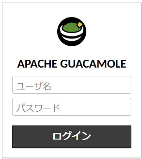
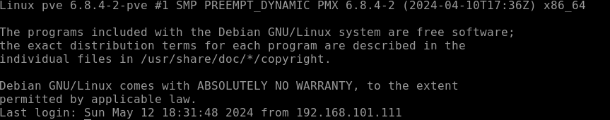

# Guacamole をインストール(Docker編)

source からインストールしたら全然苦戦したので諦めて docker でインストールする

## おまじない
```shell
apt install vim
```

## Docker のインストール

リポジトリを設定

```shell
sudo apt-get update
sudo apt-get install ca-certificates curl
sudo install -m 0755 -d /etc/apt/keyrings
sudo curl -fsSL https://download.docker.com/linux/ubuntu/gpg -o /etc/apt/keyrings/docker.asc
sudo chmod a+r /etc/apt/keyrings/docker.asc
```

リストにインストールするパッケージを追加

```shell
echo \
  "deb [arch=$(dpkg --print-architecture) signed-by=/etc/apt/keyrings/docker.asc] https://download.docker.com/linux/ubuntu \
  $(. /etc/os-release && echo "$VERSION_CODENAME") stable" | \
  sudo tee /etc/apt/sources.list.d/docker.list > /dev/null
sudo apt-get update
```

インストール

```shell
 sudo apt-get install docker-ce docker-ce-cli containerd.io docker-buildx-plugin docker-compose-plugin
```

## ユーザ追加

```shell
adduser guacamole
usermod -aG docker guacamole
```

以降は guacamole ユーザで作業

```shell
su - guacamole
```

ディレクトリ作成

```shell
mkdir guacamole
cd guacamole/
```
docker-compose.yaml

`guacamole_root_password` と `guacamole_user_password` は変更すること

```yaml
version: "3"

services:
  guacd:
    container_name: my-guacd
    image: guacamole/guacd
    restart: always

  guacamole_db:
    container_name: my-guacamole-db
    image: mysql
    restart: always
    environment:
      MYSQL_ROOT_PASSWORD: guacamole_root_password # NEED TO CHANGE
      MYSQL_DATABASE: guacamole_db
      MYSQL_USER: guacamole_user
      MYSQL_PASSWORD: guacamole_user_password # NEED TO CHANGE
    volumes:
      - ./dbdata:/var/lib/mysql
      - ./dbinit:/docker-entrypoint-initdb.d

  guacamole:
    container_name: my-guacamole
    image: guacamole/guacamole
    restart: always
    environment:
      GUACD_HOSTNAME: my-guacd
      MYSQL_HOSTNAME: my-guacamole-db
      MYSQL_DATABASE: guacamole_db
      MYSQL_USER: guacamole_user
      MYSQL_PASSWORD: guacamole_user_password # NEED TO CHANGE
      GUACAMOLE_HOME: /guacamole-home
    volumes:
      - ./home:/guacamole-home
    depends_on:
      - guacamole_db
      - guacd
    ports:
      - "8080:8080"
```

必要なディレクトリを作成

```shell
mkdir -p dbdata dbinit home/extensions
```

MySQL 初期化スクリプトを出力

```shell
docker run --rm guacamole/guacamole /opt/guacamole/bin/initdb.sh --mysql > ./dbinit/initdb.sql
```

docker compose 実行

`docker-compose` から `docker compose` とハイフンがなくなっているので注意

```shell
docker compose up -d
```

`http://<インストールしたPCのアドレス>:8080/guacamole` にアクセスして表示されるか確認する



## ログイン

- ログインID：guacadmin
- ログインPW：guacadmin

パスワードは変更すること

## Proxmox にリモートログインしてみる

設定>接続>接続の追加

以下の設定のみして接続を確認

### 接続の編集

- 名前：pve1(適当な名前)
- ロケーション：ROOT
- プロトコル：ssh

### ネットワーク
- ホスト名：(proxmox の IP アドレス)
- ポート：(proxmox の SSH ポート)

### 認証
- ユーザ名：(proxmox のログインユーザ)
- パスワード：(proxmox のログインパスワード)

右上(guacadmin)>ホーム>全ての接続情報から対象をクリック



すげぇ！

## ToDo

RDPもやりたい
