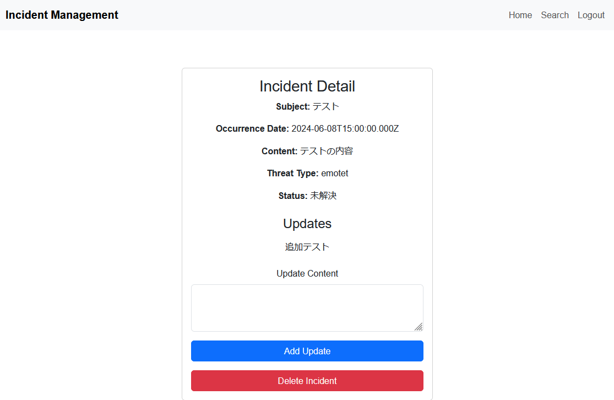

# Render.com に vue.js で開発したシステムを deploy するメモ

恥ずかしい話だが、Heroku が無料じゃなくなったのを知らなかった。

その代替案を探したところ [Render.com](rennder.com) というサービスで同じことができるらしいとのことで、開発したシステムを deploy してみることにした

## deploy するシステムについて

インシデント登録システム

ユーザはインシデントが発生したとき、本システムへログイン

ログイン後、ユーザはインシデントを登録する

登録後、インシデントを検索して経過を登録することもできる

リポジトリは以下

frontend： https://github.com/gnsnghm/inc

backend： https://github.com/gnsnghm/inc_be

## render.com への手順

frontend、 backend 共に同じ手順で OK

1. アカウントの登録
1. `+ New` > `Web Service` > `Git Provider`
1. Build Command を設定
1. Start Command を設定
1. Environment を設定

### Build Command

フロントエンド：`npm install && npm run build`  
バックエンド：`yarn`

### Start Command

フロントエンド：`npm run serve`  
バックエンド：`node index.js`

### Environment(フロントエンド)

`.env.local` でも可能だが、今回は無料版で Shell は触れないため、環境変数から設定

| 項目                 | 値                            |
| -------------------- | ----------------------------- |
| VUE_APP_API_BASE_URL | https://[xxxxxx].onrender.com |

### Environment(バックエンド)

`.env` でも可能だが、今回は無料版で Shell は触れないため、環境変数から設定

DB_SSL は通常 false で true が設定されたときのみ有効

render.com の PostrgreSQL は SSL が有効になっているため設定が必要

| 項目        | 値                                      |
| ----------- | --------------------------------------- |
| DB_HOST     | [HostName].[Region]-postgres.render.com |
| DB_NAME     | [User]                                  |
| DB_USER     | [User]                                  |
| DB_PASSWORD | [Password]                              |
| DB_PORT     | [Port]                                  |
| DB_SSL      | true                                    |

## PostgreSQL の準備

1. アカウントの登録
1. `+ New` > `PostgreSQL`
1. Name、 Database、User を設定
1. 設定後、Hostname、Port、Password などが付与される

## 起動確認

各種設定が終わると Commit、 Deploy される

Status が Deployed、 PostgreSQL は Available になっていたら使える

