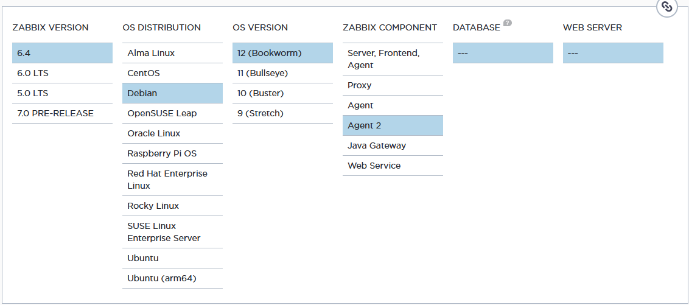
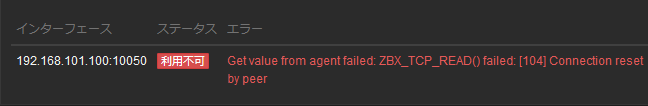
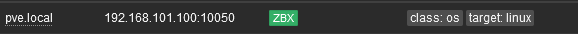

# zabbix agent 導入

## proxmox 本体に導入

```shell
root@pve:~# cat /etc/os-release
PRETTY_NAME="Debian GNU/Linux 12 (bookworm)"
NAME="Debian GNU/Linux"
VERSION_ID="12"
VERSION="12 (bookworm)"
VERSION_CODENAME=bookworm
ID=debian
HOME_URL="https://www.debian.org/"
SUPPORT_URL="https://www.debian.org/support"
BUG_REPORT_URL="https://bugs.debian.org/"
```

## インストール

[公式ページ](https://www.zabbix.com/download?zabbix=6.4&os_distribution=debian&os_version=12&components=agent_2&db=&ws=)で上のバージョンを参考にポチポチする



### zabbix repository をインストール

```shell
wget https://repo.zabbix.com/zabbix/6.4/debian/pool/main/z/zabbix-release/zabbix-release_6.4-1+debian12_all.deb
dpkg -i zabbix-release_6.4-1+debian12_all.deb
apt update
```

### zabbix agent2 をインストール

```shell
apt install zabbix-agent2 zabbix-agent2-plugin-*
```

### agent 実行・自動起動

```shell
systemctl restart zabbix-agent2
systemctl enable zabbix-agent2
```

## トラブルシューティング

いつまで経っても有効化されない



### 失敗 1

SELinux が無効化されていないのでは？

```shell
apt install selinux-utils
getenforce
```

無効なんかい

```shell
Disabled
```

## 失敗 2

raspberry pi から 10050 port が通っていないのでは？

raspberry pi から ncat してみたけどとどくんかい

```shell
sushi@raspberrypi:~ $ nc -vz 192.168.101.100 10050
Ncat: Version 7.80 ( https://nmap.org/ncat )
Ncat: Connected to 192.168.101.100:10050.
Ncat: 0 bytes sent, 0 bytes received in 0.05 seconds.
```

## 成功

ただただ config 設定していないだけだった

参考

https://www.server-world.info/query?os=Ubuntu_18.04&p=zabbix40&f=7

```conf
root@pve:~# vim /etc/zabbix/zabbix_agent2.conf

# 98行目：Zabbix サーバーを指定
Server=192.168.101.200

# Zabbix サーバーを指定
ServerActive=192.168.101.200

# 自身のホスト名に変更
Hostname=pve.local
```

```shell
systemctl restart zabbix-agent2
```

少しまったら有効化された


